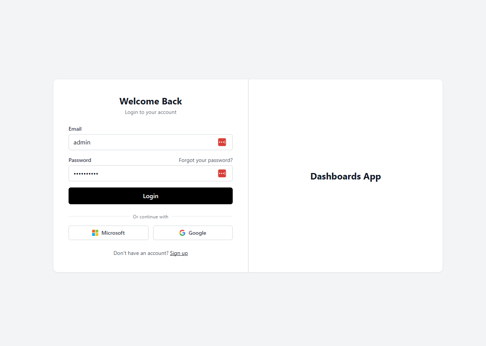
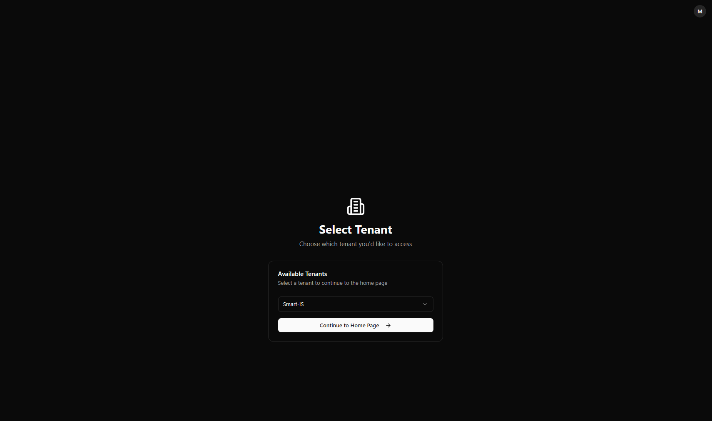
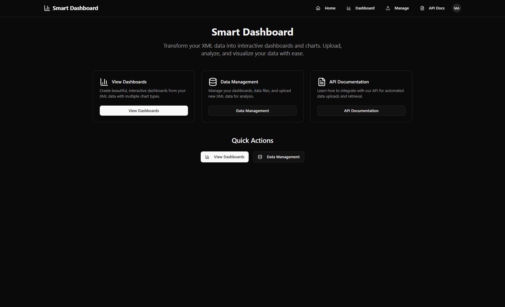
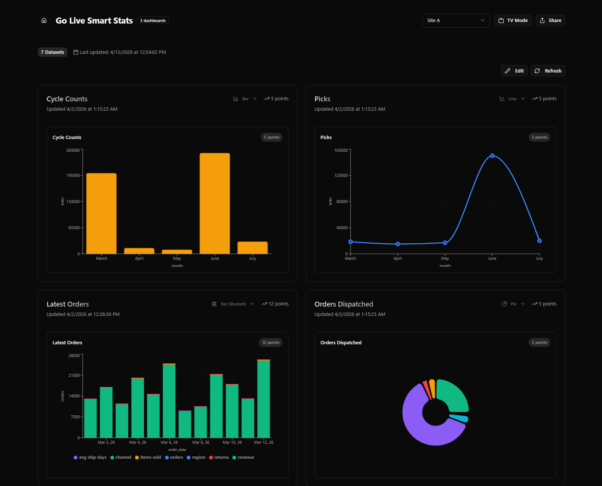

# Getting Started

This page describes the typical first-time flow for a new user.

Use these pages in order:

1. [Login](./03-login.md)
2. [Tenant Selection](./04-tenant-selection.md)
3. [Home Page](./05-home-page.md)
4. [Dashboards](./06-dashboards-page.md)

If you need to upload data:

- [API Integration (Upload API)](./08-api-docs.md) (recommended)
- [Data Management](./07-data-management.md) (manual paste for testing)

## Screenshots (quick preview)

These screenshots are a quick visual reference for the first-time journey:

### Login

### Tenant Selection

### Home Page

### Dashboards

## Sign in

Use your company’s Single Sign-On (SSO) to sign in.

See: [Login](./03-login.md)

## Select a tenant

After signing in, you’ll be asked to select a tenant (organization/workspace).

See: [Tenant Selection](./04-tenant-selection.md)

## Open your dashboards

Once inside a tenant, open the **Dashboards** page and select a dashboard.

See: [Dashboards](./06-dashboards-page.md)

## Upload data (optional)

If your dashboards are empty, upload data in one of these ways:

1. **API integration (recommended):** Use the Upload API.
2. **Manual upload (for testing):** Paste XML or JSON in **Data Management → Add Data File**.

See:

- [Data Management](./07-data-management.md)
- [API Integration (Upload API)](./08-api-docs.md)
