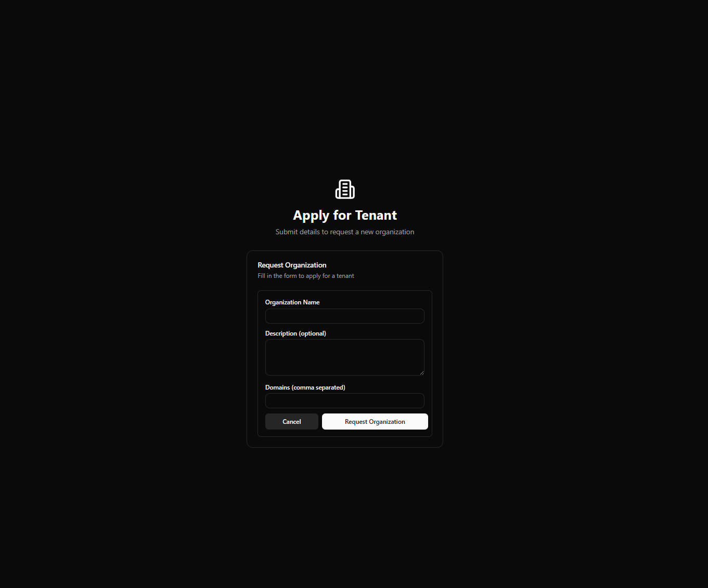
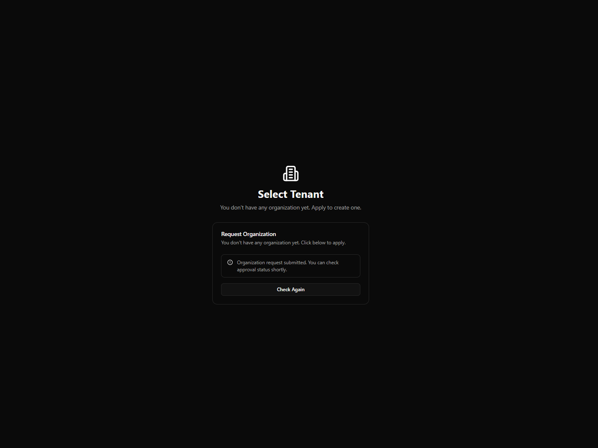
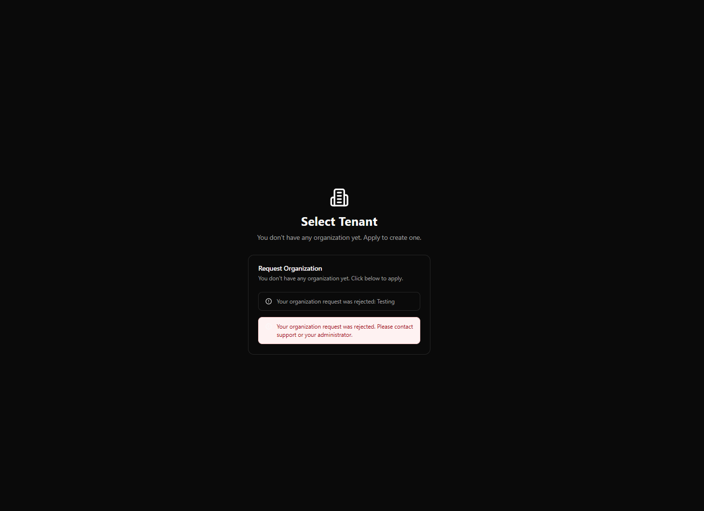

# 4) Tenant Selection

After sign-in, you choose which tenant (organization/workspace) you want to access.

## Screen

> Screenshot note: This image should show the tenant selector screen.

## If you have access to tenants

1. Choose a tenant from the dropdown.
2. Click **Continue to Home Page**.

## If you see “pending approval”

Some tenants may appear as **pending** while access is being provisioned.

- Use **Check Again** to refresh.

## If you have no tenants

If you have no tenant access yet, the screen shows a **Request Organization** flow.

> This flow is used to request an organization/tenant to be created (or to request access) and then wait for approval.

### Request Organization — step-by-step

1. Click **Apply for Tenant**.
2. Fill in the request form:
   - **Organization Name** (required)
   - **Description** (optional)
   - **Domains** (comma separated, required)
3. Click **Request Organization** to submit.

After submission, the page will show your approval status.

## Screenshots (Request Organization flow)

<!-- MAINTAINER NOTE: Replace these placeholder images with real screenshots using the same filenames. -->

### Approval statuses

- **None:** You can submit a request to create/access an organization.
- **Pending:** Your request is waiting for approval.
- **Rejected:** Your request was rejected; you can apply again.

### What to do when pending

- Use **Check Again** to re-check your status.
- Once approved, the page may auto-refresh for up to ~30 seconds while access is provisioned.

### When “Organization request not allowed” is shown

Some email domains are not eligible to request an organization (for example public email domains).

If you believe you should be eligible, contact your administrator or support.

## Access denied to a tenant link

If someone sends you a tenant link you don’t have access to, you may see an “Access Denied” message and be returned to tenant selection.
