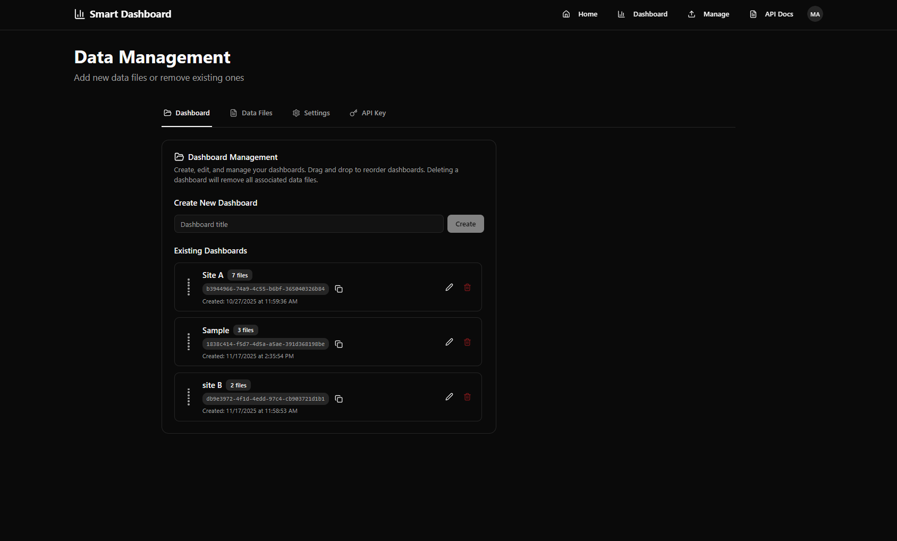
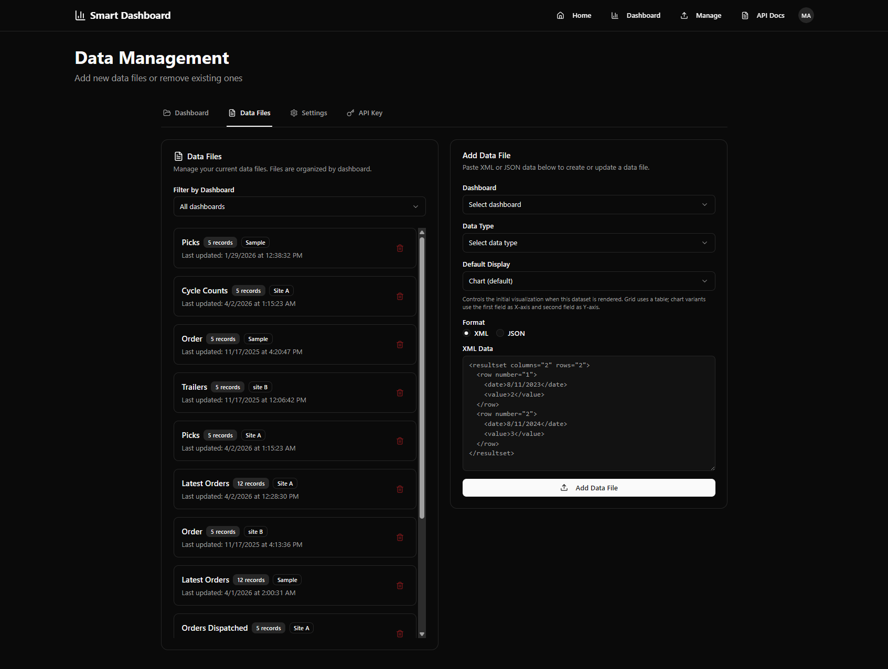

s# Data Management

The **Data Management** page is where you administer tenant content:

- Dashboards
- Data files (datasets)
- Settings
- Upload API Key

## Screen

You will see tabs at the top.

---

## Dashboard tab

Use this tab to manage dashboards.

What you can do:

- Create a dashboard (enter title → **Create**)
- Edit dashboard title
- Copy dashboard GUID (useful for integrations)
- Drag-and-drop to reorder dashboards
- Delete a dashboard (removes associated datasets)

---

## Data files tab

This tab shows all datasets in the tenant.

What you can do:

- View datasets and record counts
- Filter by dashboard
- Delete a dataset

### Data File naming

Each dataset is identified primarily by its **Data Type** (e.g., Sales).

Uploads typically **replace** the dataset of the same Data Type within the same dashboard.

---

## Add Data File (manual paste)

You can manually paste data into the UI.

Capabilities:

- Choose Dashboard (existing or **Create New Dashboard**)
- Choose Data Type (pre-defined list or **Custom Type**)
- Choose Default Display (chart or grid)
- Choose Format: **XML** or **JSON**

Default Display details:

- **Chart**: renders as a visualization (Line/Bar/Area/Pie)
- **Grid**: renders as a **Table** by default

Notes:

- The UI validates basic XML/JSON formatting before submitting.
- This is helpful for testing, demos, or one-off imports.
- For automated recurring imports, prefer the Upload API.

---

## Settings tab

Settings are tenant-specific key/value entries.

What you can do:

- Create a new setting
- Edit an existing setting value
- Delete a setting

Use cases vary by customer configuration.

---

## API Key tab

This tab manages the **Upload API key** used for machine-to-machine uploads.

What you can do:

- View a masked key (when one exists)
- Reveal the full key (if permitted)
- Copy the revealed key
- Rotate/regenerate the key (revokes old key immediately)

Security note:

- Treat this key like a password.
- Store it only in secure secrets storage.
- Do not send it in emails or chat.
