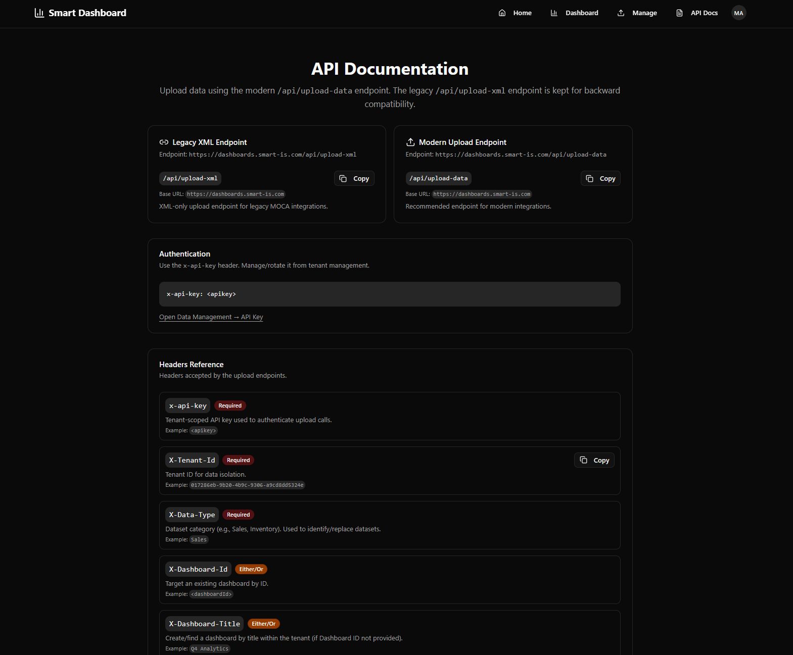

# 8) API Docs Page (Upload Integration)

Smart Dashboard includes an **API Docs** screen inside the app.

It provides ready-to-copy examples and explains which headers to send.

## Screen



## Two upload endpoints

### Recommended: JSON Upload

- **Endpoint:** `/api/upload-data`
- **Format:** JSON
- Recommended for modern integrations.

### Legacy: XML Upload

- **Endpoint:** `/api/upload-xml`
- **Format:** XML
- Kept for backward compatibility (e.g., MOCA).

## Authentication

Uploads authenticate using a tenant-scoped API key:

```
x-api-key: <your-tenant-api-key>
```

Get or rotate this key from **Data Management → API Key**.

## Required headers

The Upload APIs use headers to route and isolate your data.

| Header | Required? | Description |
|---|---|---|
| `x-api-key` | Required | Tenant API key |
| `X-Tenant-Id` | Required | Tenant ID (UUID) |
| `X-Data-Type` | Required | Dataset category name (e.g., Sales, Inventory) |
| `X-Dashboard-Id` | Either/Or | Target dashboard by GUID |
| `X-Dashboard-Title` | Either/Or | Create/find dashboard by title |
| `X-Display-Type` | Optional | Hint for initial UI rendering (e.g., grid/chart) |

## Example (cURL, JSON)

```bash
curl -X POST "https://<your-app-domain>/api/upload-data" \
  -H "Content-Type: application/json" \
  -H "x-api-key: <apikey>" \
  -H "X-Data-Type: Sales" \
  -H "X-Tenant-Id: <tenant-uuid>" \
  -H "X-Dashboard-Id: <dashboard-uuid>" \
  --data-raw '{"resultset": {"row": [{"Month": "March", "Sales": 18500}]}, "fieldOrder": ["Month", "Sales"]}'
```

## Response

Successful uploads return a JSON response with `success: true` and processing details.

> The legacy XML endpoint returns a flat JSON response for compatibility.
