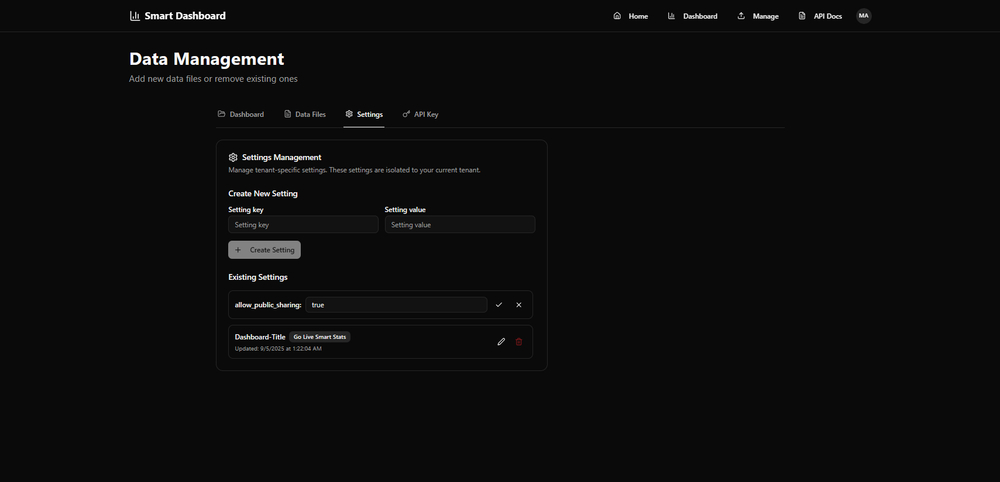
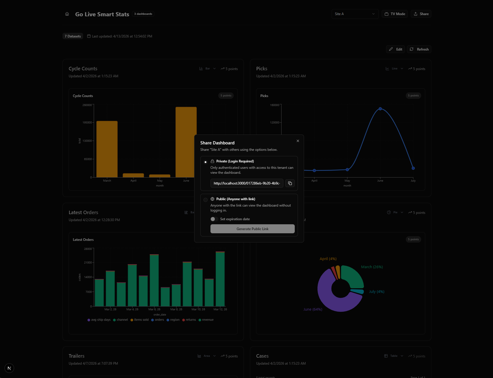
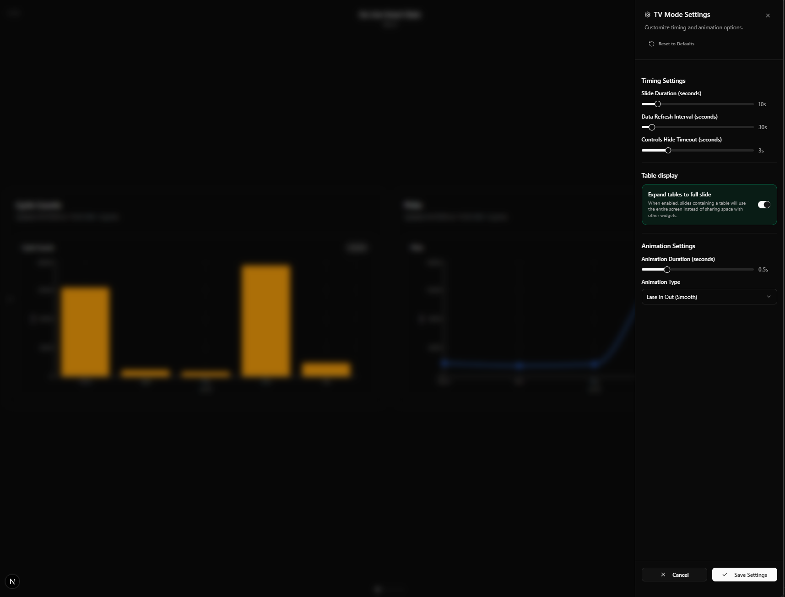
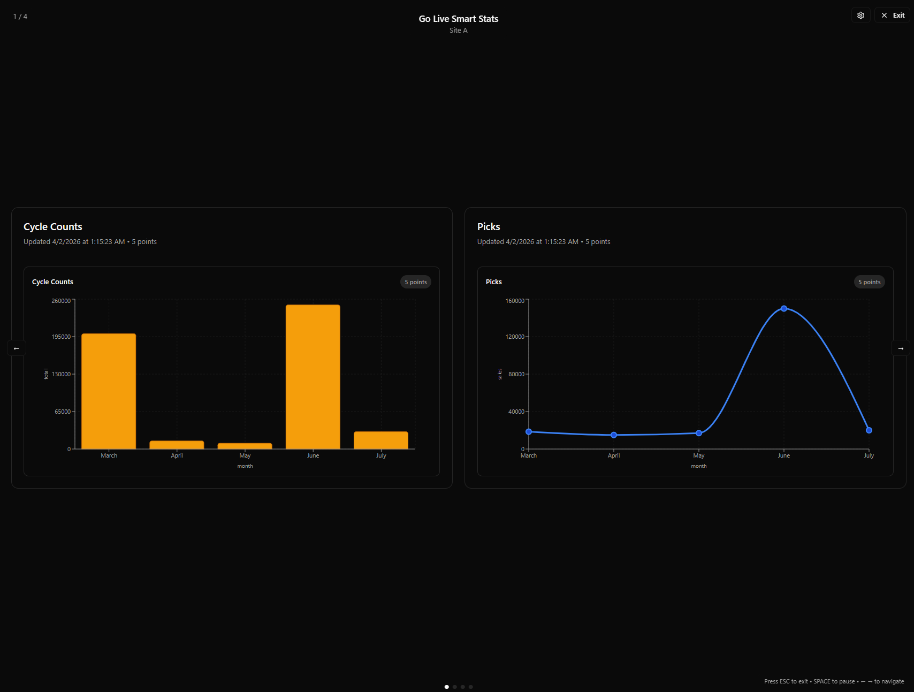

# 9) Sharing & TV Mode

Smart Dashboard supports sharing dashboards via a public link and viewing charts in TV mode.

## Public sharing (read-only)

### Prerequisite: enable public sharing for the tenant

Public sharing is controlled by the tenant setting:

- `allow_public_sharing`

To enable it:

1. Open **Data Management → Settings**
2. Create or update the key `allow_public_sharing`
3. Set the value to `true`

See: [Settings Reference](./11-settings-reference.md)

#### Screenshot (enable public sharing)



> If public sharing is disabled, the Share dialog will show Public sharing as disabled.

### How to create a public share link

1. Open **Dashboards**
2. Select a dashboard
3. Click **Share**
4. Choose **Public (Anyone with link)**
5. (Optional) Set an expiration date
6. Click **Generate Public Link**
7. Copy the URL and send it to your audience

## Screenshots



Notes:

- Share links support both a **dashboard view** (`/shared/<token>`) and a **public TV mode view** (`/shared/<token>/tv-mode`).
- TV Mode has two variants:
  1. **Authenticated TV mode** (inside tenant, requires login)
  2. **Public TV mode** (under a share token)

If your tenant enables sharing, you may generate a share link that looks like:

```
/shared/<token>
```

Behavior:

- Anyone with the link can view the dashboard **without signing in**.
- Public links are **read-only** (no edits).
- Links may have an expiry date/time.

### What recipients see

When someone opens a share link, they see a read-only dashboard view under:

```
/shared/<token>
```

## TV Mode

TV mode is optimized for wall displays.

### TV Mode settings

In TV mode, you can open **TV Mode Settings** (gear icon) to control how the slideshow behaves.

These settings are:

- Saved locally in your browser (per device)
- Used for both authenticated and public TV mode

Settings explained:

- **Slide Duration**: How long each slide stays on screen.
- **Data Refresh Interval**: How often TV mode reloads the latest stored data for the dashboard.
  - This does not pull from your source system; your system still pushes updates via API.
- **Controls Hide Timeout**: How quickly on-screen controls auto-hide.
- **Expand tables to full slide**: When enabled, table/grid slides can use the full screen for readability.
- **Animation Duration**: Transition speed between slides.
- **Animation Type**: The easing used for slide transitions.

#### Screenshot (TV Mode settings)



## Screenshot



Two variants exist:

1. **Authenticated TV mode** (inside tenant, requires login)
2. **Public TV mode** (under a share token)

Public TV mode route:

```
/shared/<token>/tv-mode
```

## Best practices

- Use a dedicated display account or share link with controlled distribution.
- If you rotate datasets frequently, set up automated uploads.
