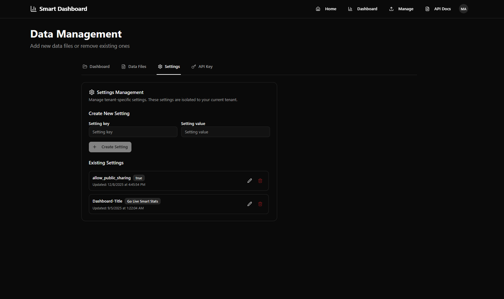

# Settings Reference

This page explains the **tenant settings** that affect Smart Dashboard behavior.

You can manage settings in **Data Management → Settings**.

> Settings are **tenant-specific**. Changing a setting affects only the currently selected tenant.

> Note: TV mode also has **viewer settings** (slide duration, refresh interval, etc.). Those are not tenant settings and are saved locally in your browser. See: [Sharing & TV Mode](./09-sharing-and-tv-mode.md).

## Where to manage settings

Open **Data Management → Settings**.

## Recommended initial setup

For most tenants, these are the first settings to review:

1. **Dashboard-Title**: Controls the default title used in parts of the UI (for example TV mode headers).
2. **allow_public_sharing**: Controls whether users can generate public (read-only) share links.

## allow_public_sharing

**Purpose**: Controls whether dashboards in the tenant can be shared publicly (read-only).

- `true` → users can generate public share links
- `false` → public sharing is disabled (default)

Where it is used:

- The **Share Dashboard** dialog checks this setting and disables public sharing when it is `false`.
- Public routes under `/shared/<token>` are blocked if this setting is disabled.

## Dashboard-Title

**Purpose**: Sets the default dashboard title used in places like TV mode headers.

Notes:

- This key is **case-sensitive** and should be exactly `Dashboard-Title`.
- Some older tenants may have a legacy key `dashboard-title`. If you see both, prefer `Dashboard-Title`.

Recommended value:

- A short label like `Dashboard`, `KPI Dashboard`, or your organization name.

### Default behavior (from the application)

For new tenants, the application auto-provisions:

- `allow_public_sharing = false`
- `Dashboard-Title = Dashboard` (only if neither `Dashboard-Title` nor the legacy `dashboard-title` exists)

## Other settings

Your tenant may have additional settings that are specific to your organization’s setup.
If you are unsure what a setting does, contact your administrator or support.
