# Integrating Smart Dashboard with BY Portal

This guide walks you through embedding **Smart Dashboard** into your **BY Portal** using the **Page Builder** and **Menu Editor**.

> Notes
>
> - This integration uses a **Public Share Link** from Smart Dashboard.
> - Public links are **read-only**.
> - Public sharing may need to be enabled for your tenant. See: [Sharing & TV Mode](./09-sharing-and-tv-mode.md#public-sharing-read-only)

---

## Step 1: Get the Public Share Link from Smart Dashboard

1. Log in to your Smart Dashboard account.
2. Navigate to the **View Dashboard** screen.

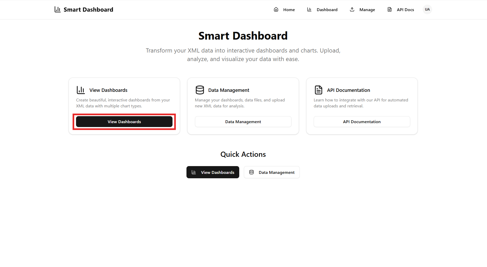

3. Select the warehouse you want the dashboards for, then click **Share**.

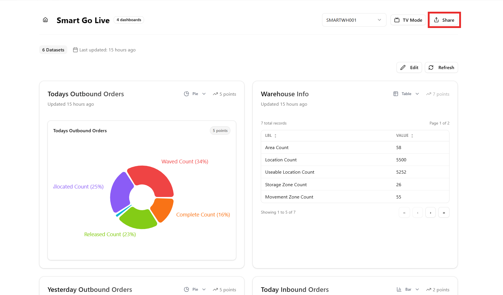

4. Copy the **Public Share Link** that is generated.

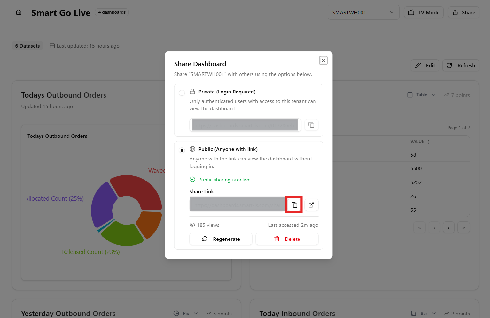

---

## Step 2: Add an External Page in BY Portal

1. Log in to your BY Portal.
2. Go to **Extensions** from the main navigation.

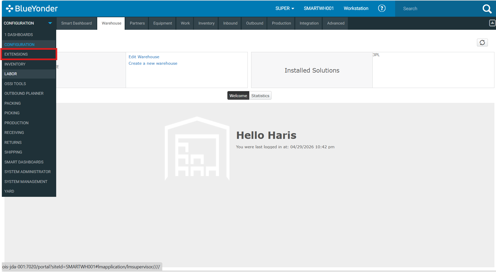

3. Select **Page Builder**.

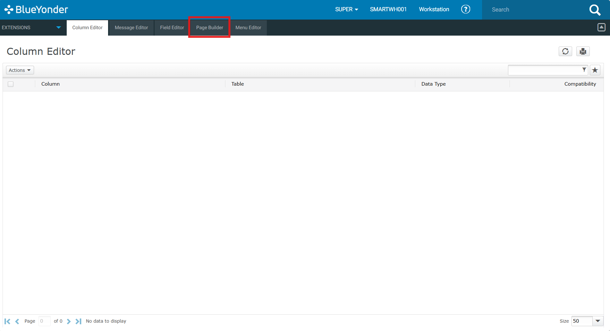

4. Under **Actions**, click **Add External Page**.

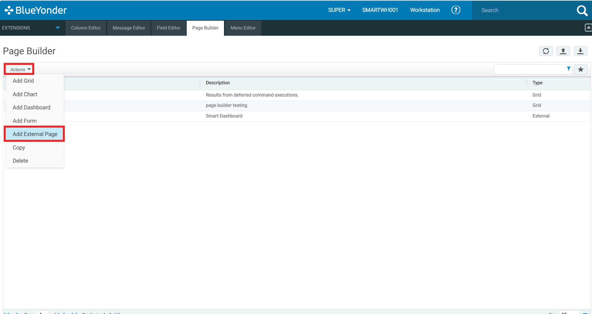

5. Fill in the following fields:

   - **Title:** Enter a descriptive name for the page
   - **Description:** (Optional) Enter a short description
   - **URL:** Paste the Public Share Link copied from Smart Dashboard

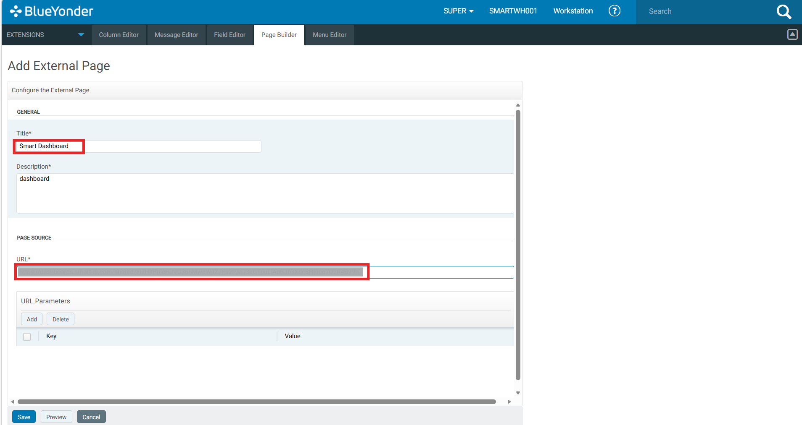

6. Save the page.

---

## Step 3: Add the Page to a Menu

1. In the BY Portal, navigate to **Menu Editor**.

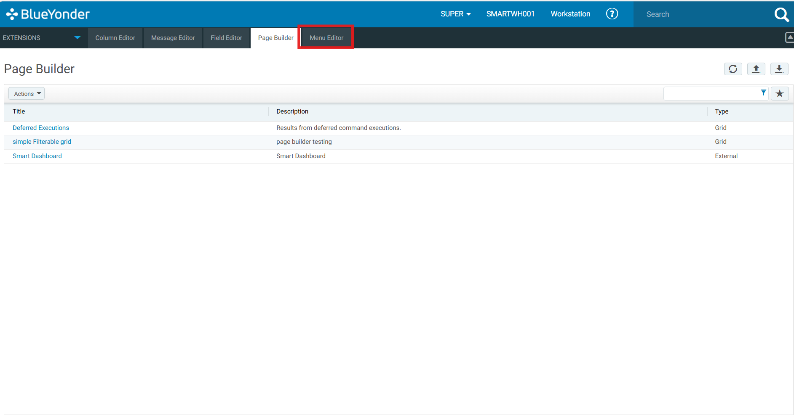

2. Create a new **Menu Group** (or select an existing one where you want the dashboard to appear).

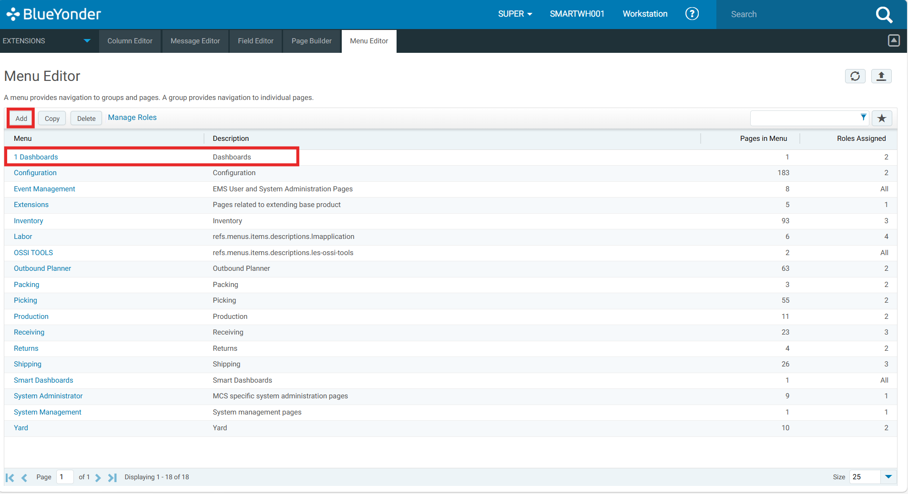

3. Assign the external page you created in Step 2 to that menu group.

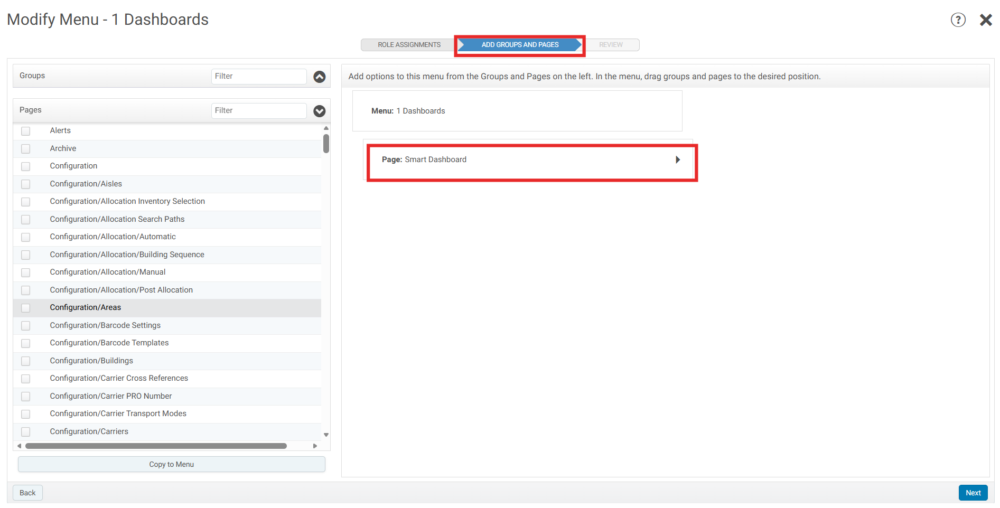

4. From the **Review** section, add the **Roles**.

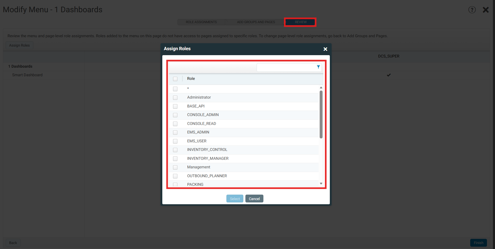

5. Save your changes.

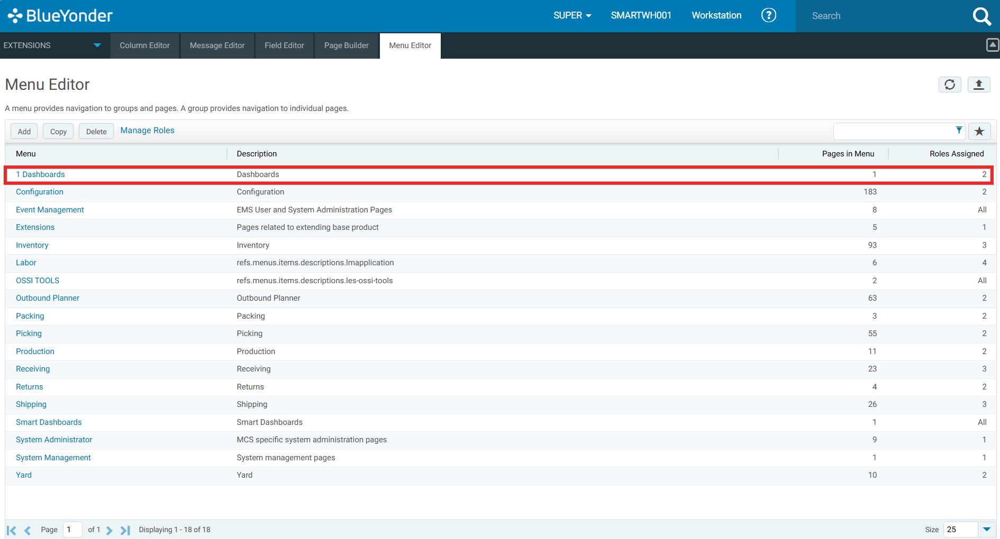

---

## Result

The Smart Dashboard will now appear as a menu item in your BY Portal, accessible to users.

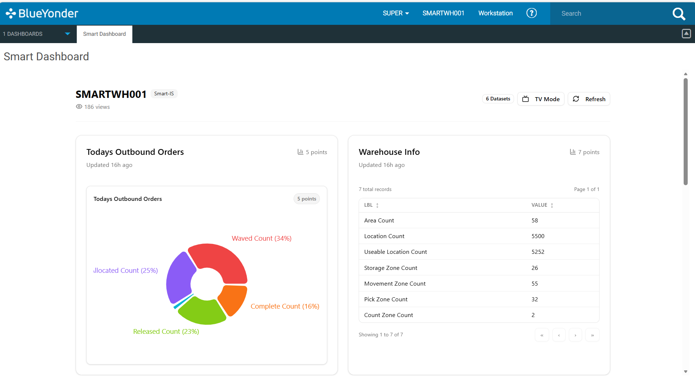
