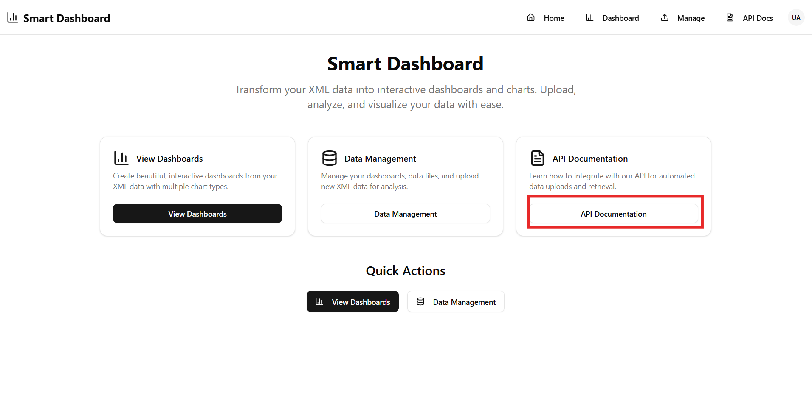

# API Documentation

The **API Documentation** page provides guidance on how to upload and manage data in Smart Dashboard using API integrations.

This section is intended for developers or technical users who want to automate data uploads and integrate external systems with the platform.

  

## What You Will Find on This Page

### Data Upload Methods
- Instructions for uploading data using:
  - **Legacy XML Endpoint** (for backward compatibility)
  - **Modern JSON Endpoint** (recommended for new integrations)

### Request Examples
- Ready-to-use **cURL examples** for both XML and JSON uploads
- Sample payload structures for quick implementation

### Authentication Options
- Supported authentication methods:
  - **x-api-key header**
  - **Authorization Bearer token**

### Headers Reference
- Detailed explanation of required and optional headers such as:
  - Tenant ID
  - Data Type
  - Dashboard ID or Title

### Response Format
- Sample API response showing:
  - Upload status
  - Number of records processed
  - Dashboard details

**When to Use This Page**

Use this documentation if you want to:

- Automate data uploads to dashboards
- Integrate Smart Dashboard with external systems
- Send real-time or scheduled data updates

---

> 💡 **Tip:**  
For most use cases, the **JSON Upload API** is recommended as it provides more flexibility and supports modern integration workflows.