# Data Management 

The Data Management screen allows you to create, organize, and manage your dashboards and their associated data files.

It serves as the control center for organizing and maintaining your dashboard environment.

- Navigate to **Data Management** from the Home Page.

<div style="text-align: center;">
  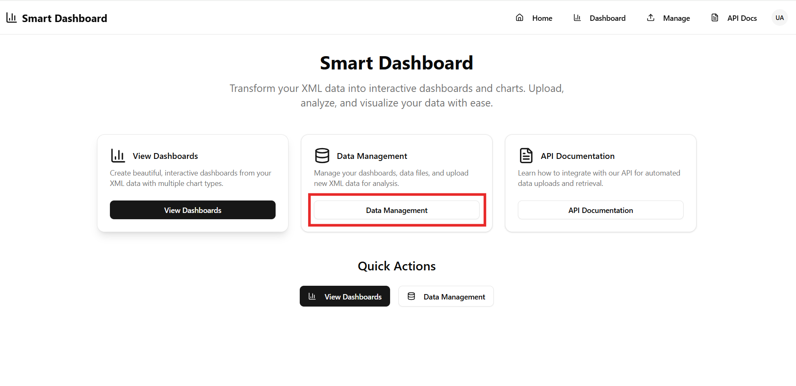
  </div>

This screen is divided into four main tabs:

- Dashboard
- Data Files
- Settings
- API Key

Each tab serves a specific purpose, explained below.

## Dashboard 

The Dashboard Management tab allows you to create, edit, organize, and manage your dashboards in one place.

You can:
- Create new dashboards
- Edit existing dashboards
- Drag and drop to reorder dashboards
- Delete dashboards when no longer needed

⚠ **Important:**  
Deleting a dashboard will permanently remove all associated data files linked to that dashboard.

<div style="text-align: center;">
  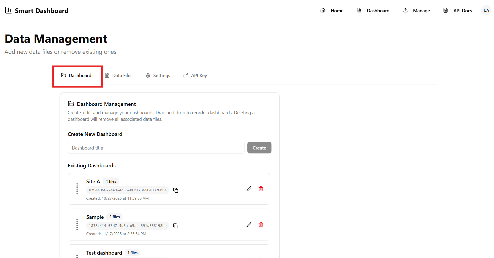
  </div>

- **Creating a new Dashboard**
   1. Enter a Dashboard Title and click Create.

   <div style="text-align: center;">
  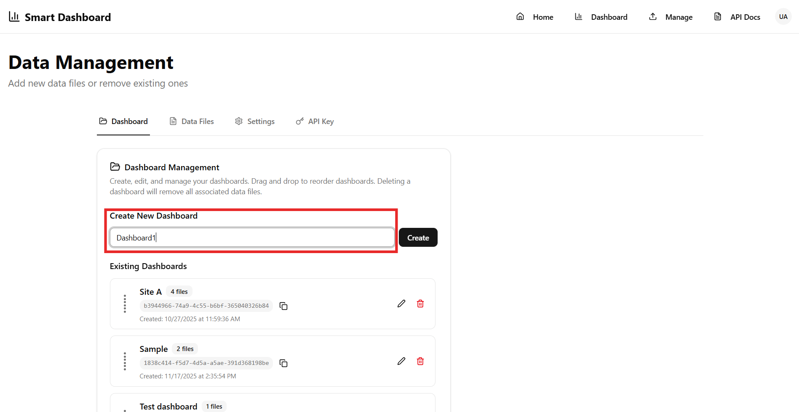
  </div>

  2. he dashboard will appear under **Existing Dashboards**. You can now Edit or Delete it as well.

   <div style="text-align: center;">
  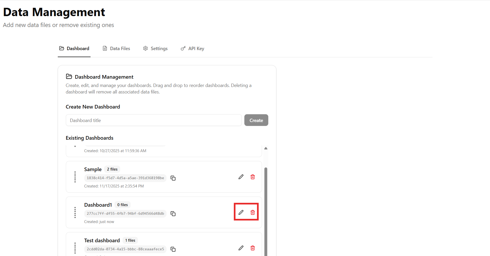
  </div>

3. A unique **Dashboard Key** will be generated.

  <div style="text-align: center;">
  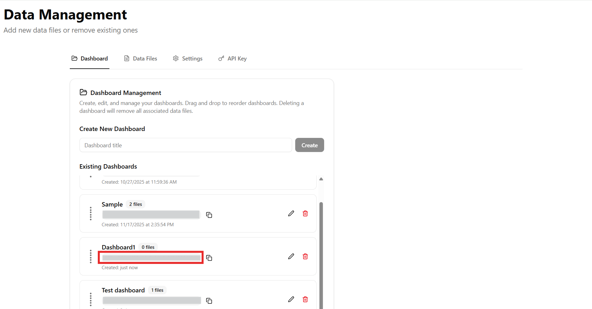
  </div>

  🔑 Keep the Dashboard Key secure, as it is required when uploading data to this dashboard.


##  Data Files
The Data Files tab allows you to upload and manage data for your dashboards.  
All files are organized by dashboard for easy tracking and control.

When you open Data Files, you can:
  - View previously uploaded files (if any exist)
  - Filter files by dashboard
  - Delete existing data files

  <div style="text-align: center;">
  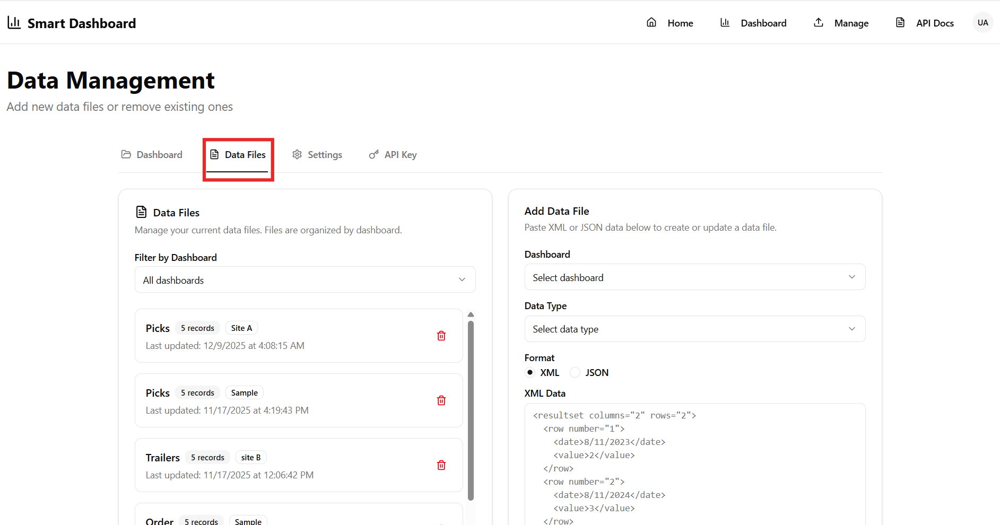
  </div>

- **Add a New Data File**:

  As a new user, your next step is to add data to the dashboard you created.

  To upload a new data file:

  1. Click Add Data File.

 <div style="text-align: center;">
  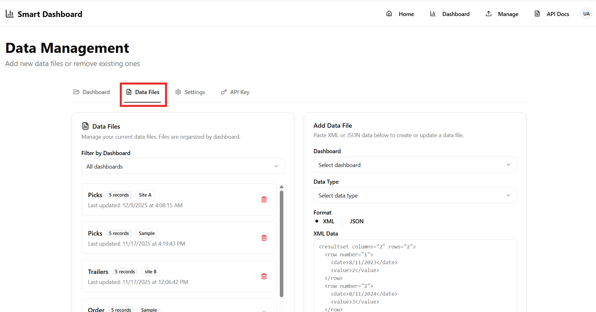
  </div>

  2. Select the **Dashboard** you created earlier

 <div style="text-align: center;">
  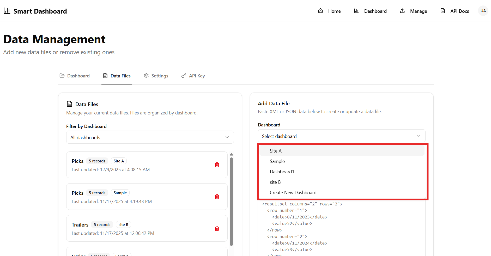
  </div>

  3. Choose the appropriate **Data Type**

   <div style="text-align: center;">
  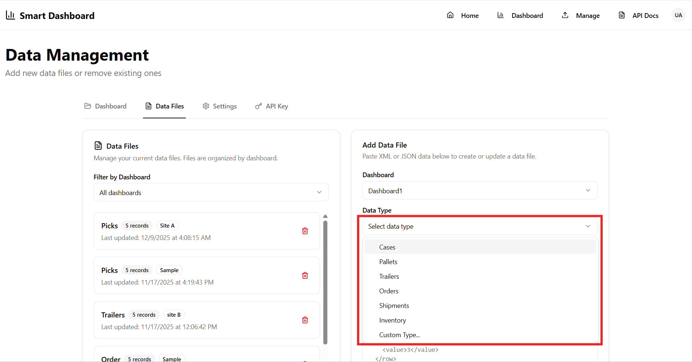
  </div>

  4. Paste your XML data or JSON and Add Data File.

   <div style="text-align: center;">
  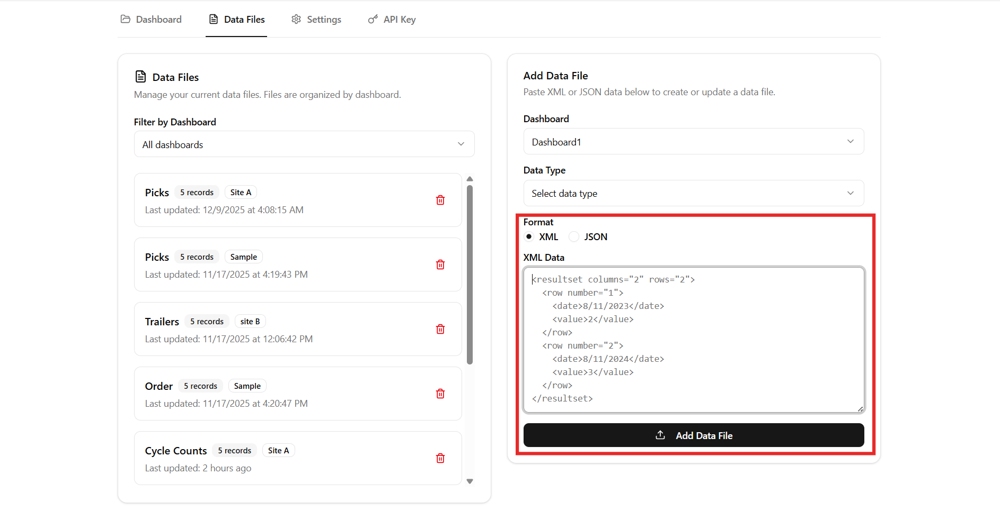
  </div>

  5. The data will be added for your selected Dashboard.

**Example XML Response**

```xml
<resultset columns="2" rows="5">
  <row number="1">
    <month>March</month>
    <sales>18500</sales>
  </row>
  <row number="2">
    <month>April</month>
    <sales>15000</sales>
  </row>
  <row number="3">
    <month>May</month>
    <sales>17000</sales>
  </row>
  <row number="4">
    <month>June</month>
    <sales>150000</sales>
  </row>
  <row number="5">
    <month>July</month>
    <sales>20000</sales>
  </row>
</resultset>
```


This method is intended for XML uploads, but we do not recommend using it because it always returns static values. To get updated data, you must manually modify the XML file each time.

- **We also support automated uploads through the Smart Moca Client using a script, or through the API.**


**Example MOCA Script**

  ```moca
    {publish data where month = 'March' and sales= 18500 
    &
    publish data where month = 'April' and sales =15000
    &
    publish data where month = 'May' and sales =17000
    &
    publish data where month = 'June' and sales =150000
    &
    publish data where month = 'August' and sales =20000
    }
    >> rs
    |
    convert result set to xml
    |
    get xml
    |
    publish data where x = @mxml_xml
    |
     {
    do http request
    where url = 'https://dashboards.smart-is.com/api/upload-xml'
    and method = 'post'
    and header = '<API-KEY>&X-Data-Type:<DATA TYPE>X-Tenant-Id:<TENANT ID>&X-Dashboard-Id: <DASHBOARD ID>'
    and body = @x 
    }
 ```
| Header / Field Name   | Description |
|-----------------------|-------------|
| **x-api-key**         | Your API Key used for authentication. |
| **X-Data-Type**       | The header representing the type of data for your visual (e.g., Trailers, Shipments, Inventory). |
| **X-Tenant-Id**       | The Tenant ID assigned to your organization. |
| **X-Dashboard-Id**    | The Dashboard ID of the dashboard you created to upload data into. |

You will get the success message and your data is pushed to your **Dashboard**

   <div style="text-align: center;">
  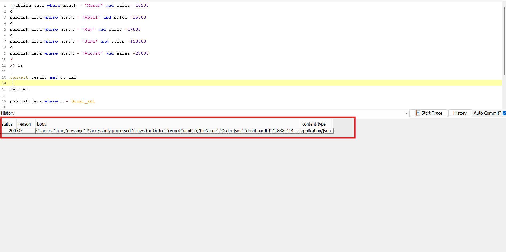
  </div>


## Settings

The Settings is where you can control and adjust your dashboard's configuration.

  <div style="text-align: center;">
  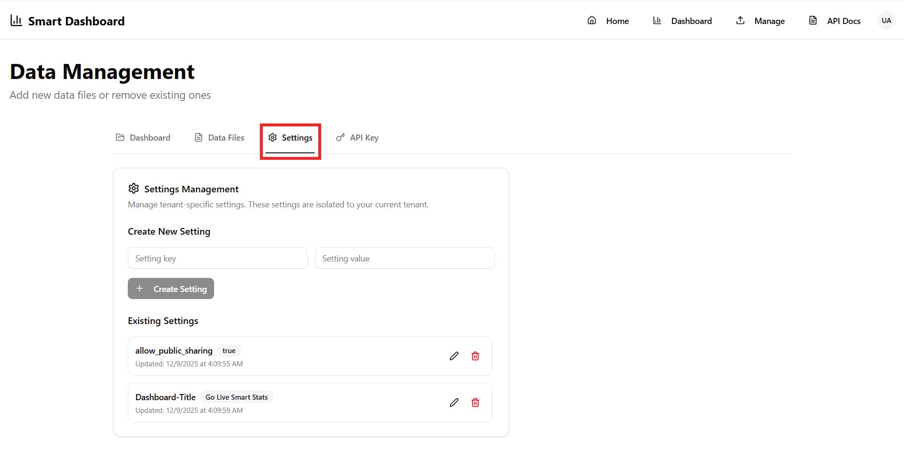
  </div>

Note: These settings are tenant-specific, meaning they only apply to your current tenant and won’t affect other tenants.

- **Manage Access**

  By default, you’ll see two settings:

  - **allow_public_sharing = true**: This means anyone with the dashboard link can view it.

  - **Dashboard Title** :You can change the name of your dashboard here.

  You can also create additional custom settings if you want more control.

- **Adding a Custom Setting**
To create your own setting:

  1. Enter a Setting Key (the name of your setting).

  2. Enter a Setting Value (the value for your setting).

  3. Click Create Setting.

  <div style="text-align: center;">
  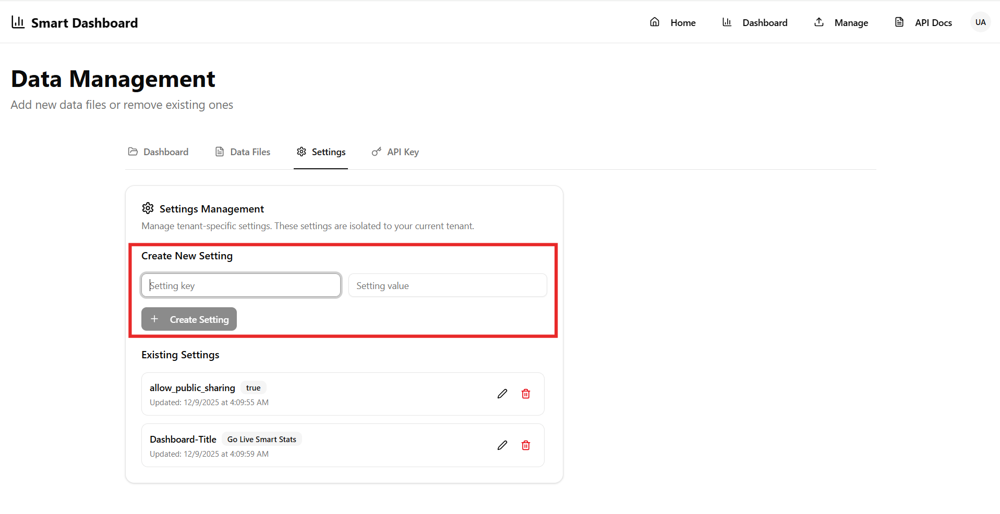
  </div>


Your new setting will appear immediately in the list.
