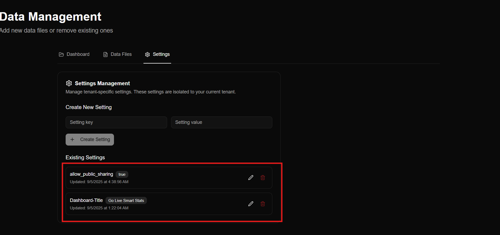

## Creating a New Dashboard
You can see three options on **Home Page** Screen
### 1. View Dashboards
If you have created any dashboards, you can view all your existing dashboards here.

### 2. Data Management
To create a new dashboard, go to the **Data Management** section.

### 3. API Documentation
This section contains a small user guide on how to integrate with our API for automated data uploads and data retrievals.


**As a new user, the first step is to create a dashboard.**


**Go to **Data Management**. You will see three options:**


---

### 1. Dashboard
- Enter a **Title** for your new dashboard.
- Click **Create**.

    

- After creating, your dashboard will appear under 
**Existing Dashboards**.
- You will also see your **Dashboard Key**.  
  **Important:** Remember this key — it is 
  required when pushing data into the dashboard.

    

---

### 2. Data Files
When you click on **Data Files**, you will see:
- Your existing files (if any dashboards were created earlier).
- You can filter files by dashboard.
- You can delete existing data files.

    

Since we are new users, focus on **Add Data File** to create your first data file.

To add a new data file:
1. Select the **dashboard** you created in the previous step.
2. Select the **data type** for your file.
3. Add the **XML data**.

    

### Example XML Response

```xml
<resultset columns="2" rows="5">
  <row number="1">
    <month>March</month>
    <sales>18500</sales>
  </row>
  <row number="2">
    <month>April</month>
    <sales>15000</sales>
  </row>
  <row number="3">
    <month>May</month>
    <sales>17000</sales>
  </row>
  <row number="4">
    <month>June</month>
    <sales>150000</sales>
  </row>
  <row number="5">
    <month>July</month>
    <sales>20000</sales>
  </row>
</resultset>
```


This method is for XML uploads.  
We also support automated uploads through the **Smart Moca Client** using a script.

---

### Example MOCA Script

    ```moca
    {publish data where month = 'March' and sales= 18500 
    &
    publish data where month = 'April' and sales =15000
    &
    publish data where month = 'May' and sales =17000
    &
    publish data where month = 'June' and sales =150000
    &
    publish data where month = 'August' and sales =20000
    }
    >> rs
    |
    convert result set to xml
    |
    get xml
    |
    publish data where x = @mxml_xml
    |
    {
    do http request
    where url = <Dashboard URL>
    and method = 'post'
    and header = '<API-KEY>
    &
    X-Data-Type: <DATA TYPE>
    &
    X-Tenant-Id: <TENANT ID>
    &
    X-Dashboard-Id: DASHBOARD ID'
    and body = @x 
    }


You will get the success message and your data is pushed to your **Dashboard**


### 3. Settings

The third tab under Data Management is **Settings**, where you can manage dashboard access and configuration.

### Manage Access
- **allow_public_sharing = true**  
  This means **anyone** with the dashboard link can access the dashboard.
- You can also update the **title** of your dashboard in this section.

### Creating a New Setting
To add a new custom setting:
1. Enter the **Setting Key**.
2. Enter the **Setting Value**.
3. Click **Create Setting**.

Your new setting will be added to the list immediately.



Once your dashboard is created, you can view and manage all your dashboards in one place.

👉 **[View Dashboards](/User_Guide/view_dashboard.md)**