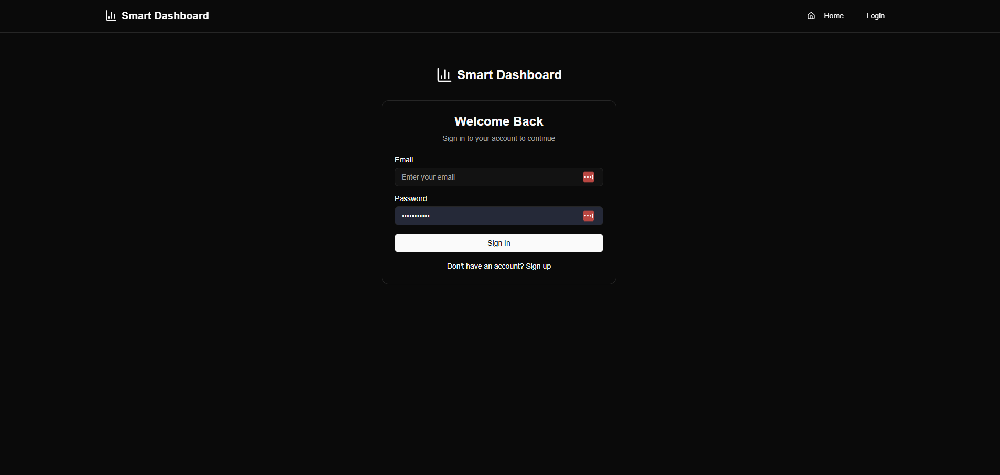
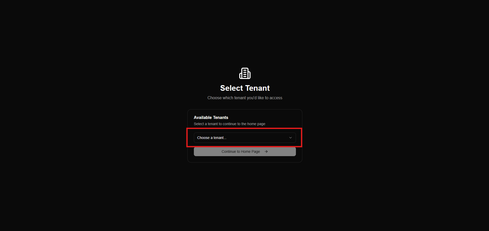
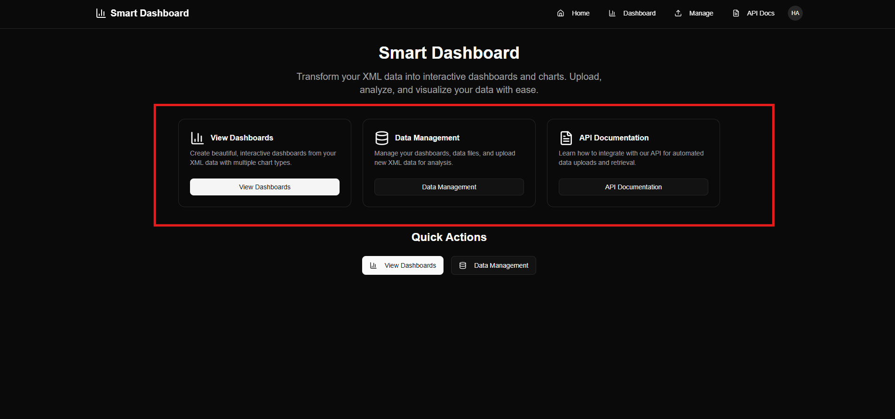

# Setup Guide
## Step 1: Login Page

👉 **Access the Smart Dashboard here:** https://dashboards.smart-is.com/

Upon opening the application, the user will see the login page
 

### Sign In
- Enter your **email** and **password**.
- Click the **Sign In** button to proceed to the product.

### Sign Up
If you don't have an account, click **Sign Up** to create a new one.

## Step 2: Tenant Selection
Our system is **tenant-based**.

After signing in, you will be navigated to the **Tenant Selection** screen 

- If you signed in with an **organization account**, and we have already assigned you a tenant, you will **automatically see your assigned tenant** displayed on this screen.
- Or choose your tenant from the dropdown/list.

After selecting the tenant, click **Continue** to proceed to the **Home Page**.

## Step 3: Home Page Overview

Now you can see the **Home Page** of the Smart Dashboard, where multiple options are available:

Once your setup is complete, you’ll be ready to create your first dashboard.  
To learn how to create a new dashboard,

**[Create Dashboard](../User_Guide/create_dashboard.md)**
