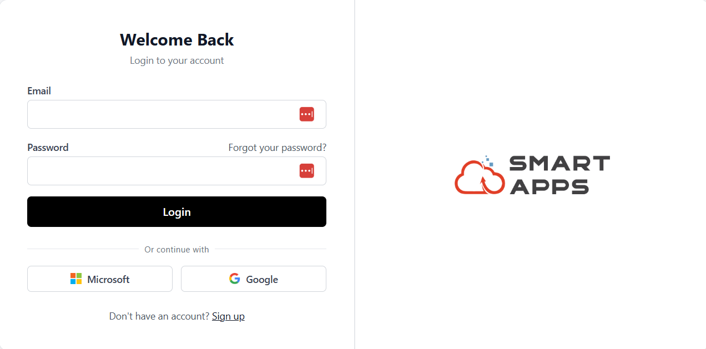
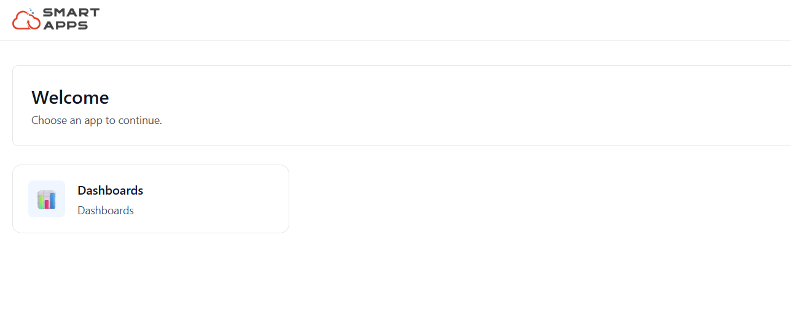

# Setup Guide

To access Smart Products, the user must first sign in at https://auth.smart-is.com/login 

After the first login, the user will automatically gain access to all products assigned to their account.

## Step 1: Login Page

To access the Smart Dashboard, sign in at https://auth.smart-is.com/login 

Upon opening the application, the login page will appear.

### Sign In
- Enter your **email** and **password**, or sign in using your **Microsoft Account**.
- Click **Login** to continue to the product.

### Sign Up
If you don't have an account, click **Sign Up** to register a new one.

## Step 2: Product Selection

After signing in, you will be navigated to the Home Page, where all assigned products are displayed.

Click **Dashboards** to continue.

## Step 3: Tenant Selection
Our system is **tenant-based**.

After signing in, you will be taken to the **Tenant Selection** screen.

- If you sign in with an **organization account** and a tenant has already been assigned to you, it will automatically appear here.
- Alternatively, select your tenant from the dropdown/list.

After selecting the tenant, click **Continue** to proceed to the **Home Page**.

## Step 4: Home Page Overview

Once the tenant is selected, you will be able to view the **Home Page** of the Smart Dashboard, which provides access to multiple features and modules.

Once your setup is complete, you’ll be ready to create your first dashboard.  
To learn how to create a new dashboard,

**[Create Dashboard](/User_Guide/create_dashboard.md)**
