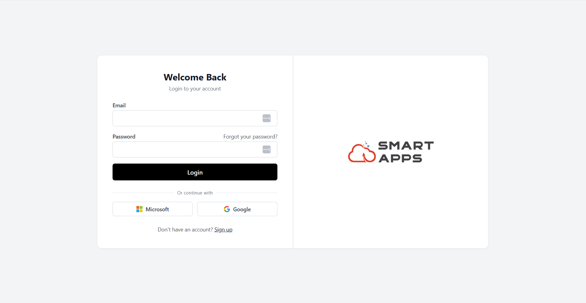

# Setup Guide

Follow the steps below to access and start using Smart Dashboard.

Access the Smart Dashboard here: https://dashboards.smart-is.com/

1. When you open the link, the Login Page will appear.

 
 - **Sign In**
    - Enter your email and password or continue with Microsoft or Google.
    - Click the Sign In button to proceed.

- **Sign Up**

    If you don't have an account, click **Sign Up** to create a new one.

2. Smart Dashboard operates on a tenant-based system, meaning each organization has its own secure workspace.

    After signing in, you will be directed to the **Tenant Selection** screen.

- If a tenant has already been assigned to you, it will be displayed automatically.
- If multiple tenants are available, select the appropriate one from the list or dropdown.
- Click Continue to proceed.

3. After selecting your tenant, you will land on the **Home Page** of Smart Dashboard.

---
