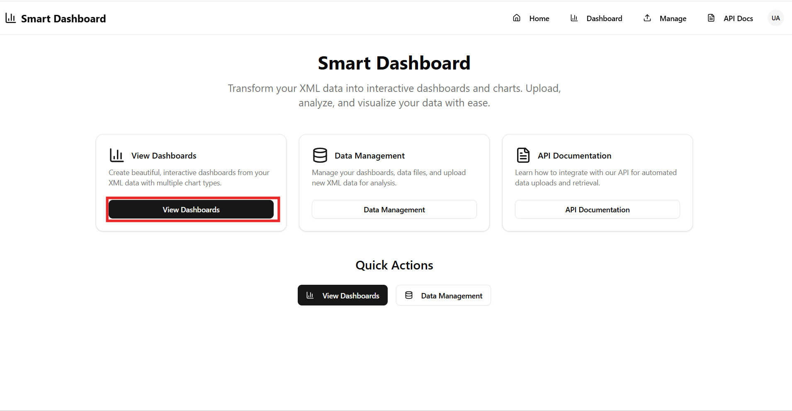
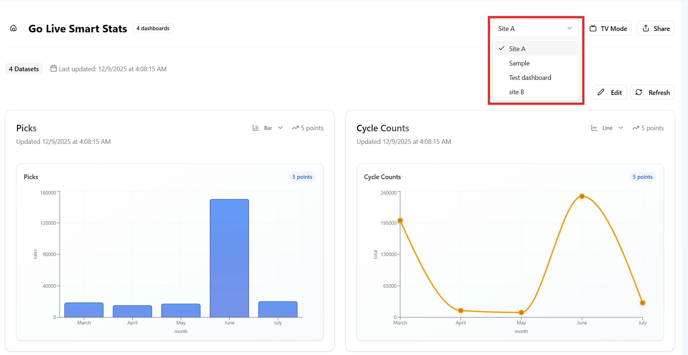
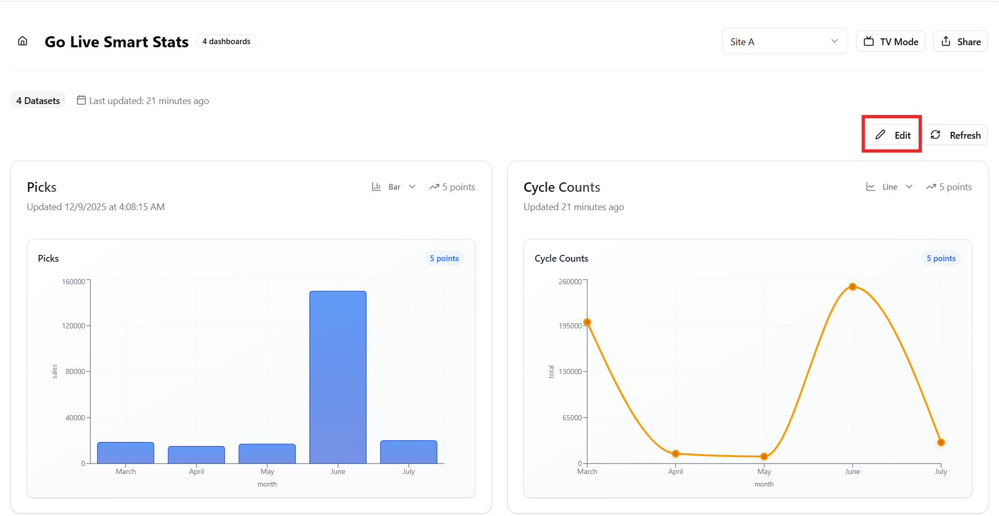
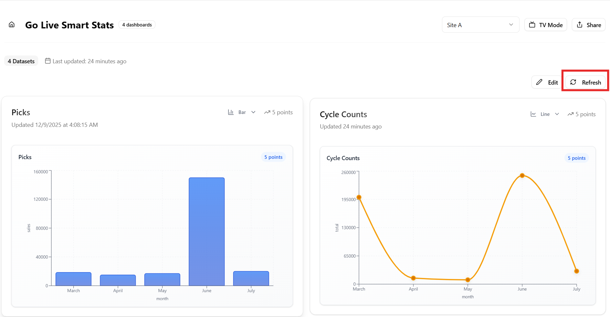
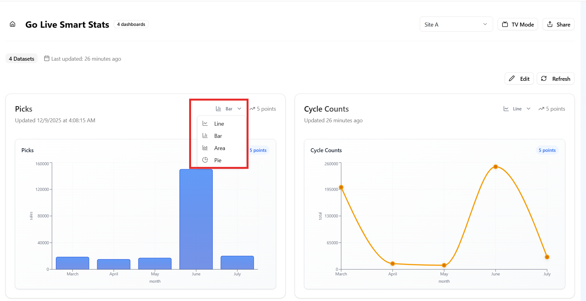
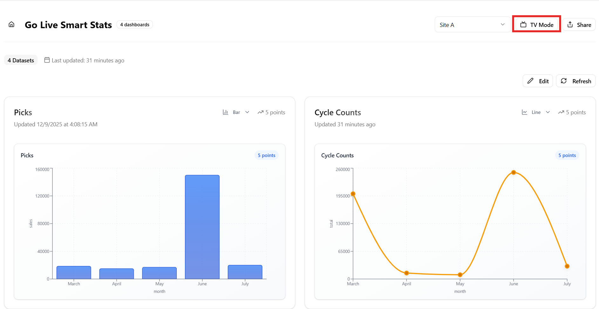
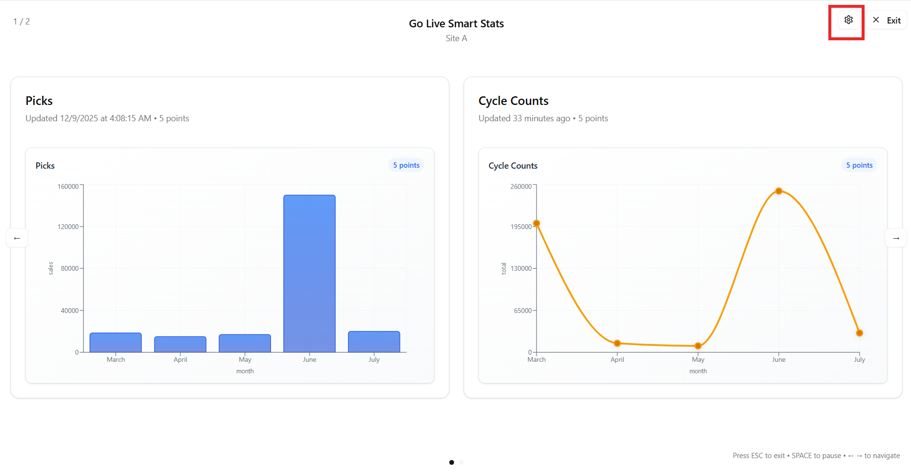
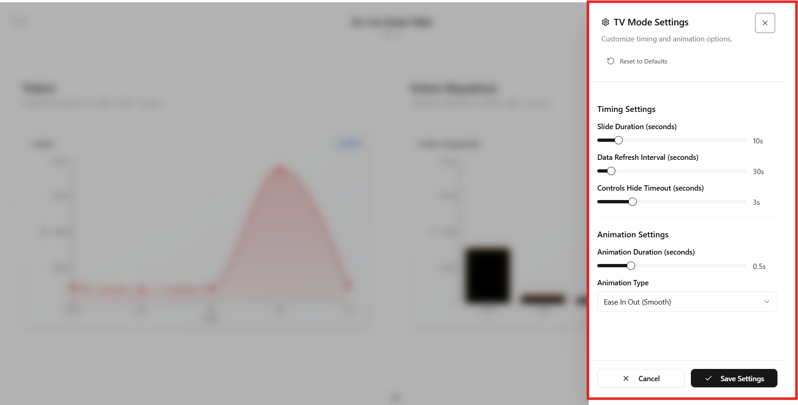

# Viewing Created Dashboards

Once you have created a dashboard, you can access it from the View Dashboards section.

- Navigate to **View Dashboards** from the Home Page.

  
  

- You can see your created dashboards here and select any dashboard from the **dropdown list**.

  
  

## Features
The following options are available while viewing a dashboard:

1. **Edit Visual Positions**:

    Rearrange visuals on the dashboard to match your preferred layout.

  

  
  

2. **Refresh Data**:

    Update the dashboard to display the latest available data.

  

  
  

3. **Change Visual Type**

    Switch between different chart types using the dropdown menu.  
    Available options include:
    - Line Chart  
    - Bar Chart  
    - Area Chart  
    - Pie Chart 

  

  
  

## TV View Mode

TV View Mode allows dashboards to run automatically in a hands-free display format.  

This feature is ideal for control rooms, warehouses, and office environments.

- You can activate TV mode from the option available. 

  

  
  

You can adjust the following settings by navigating to the settings tab.

  

  
  

- **Timing Controls**

  Adjust slide duration, data refresh interval, and controls hide timeout.  

- **Animation Controls**
  Set animation duration and choose your preferred animation type.

- **Reset Option**

  Restore all TV Mode settings to their default configuration with a single click.

  

  
  

  
  ---