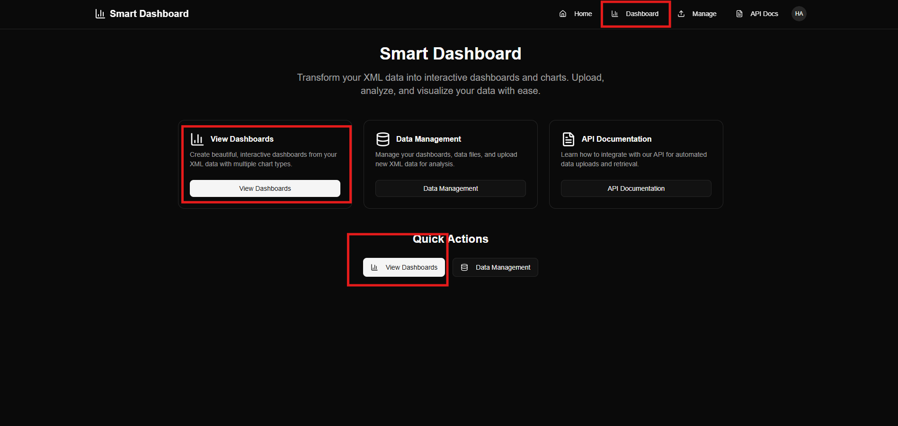
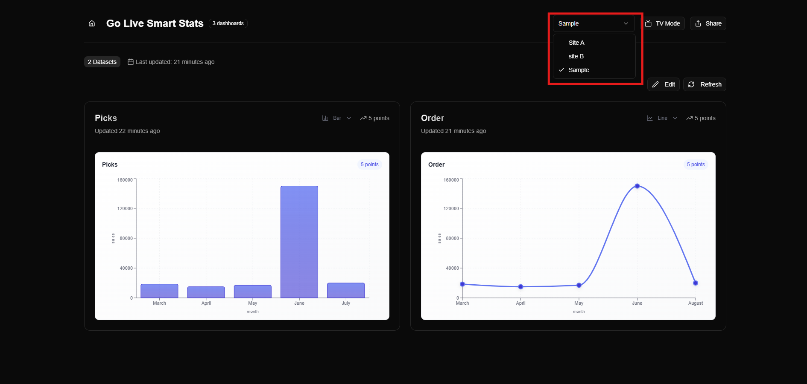
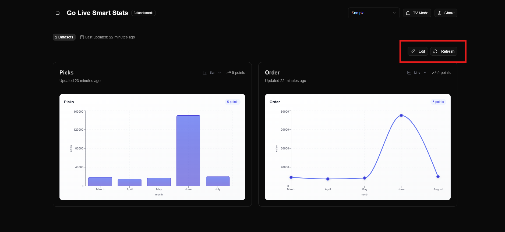
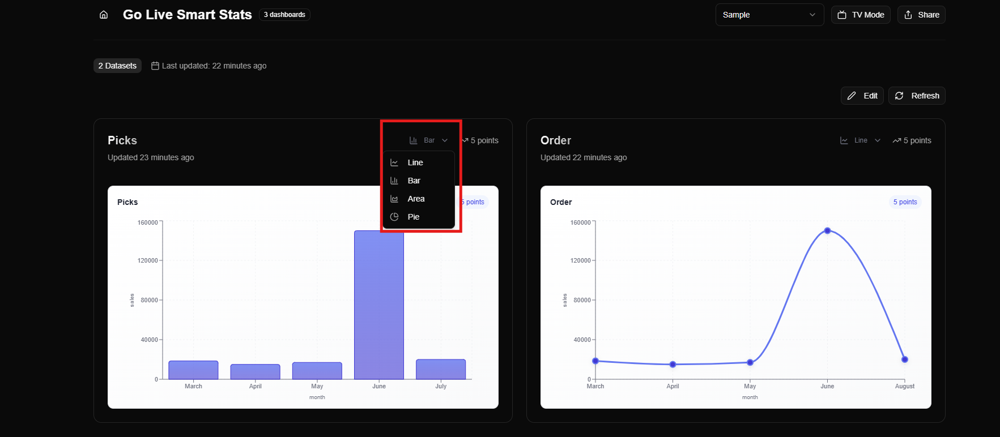
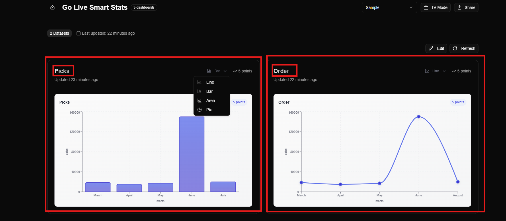
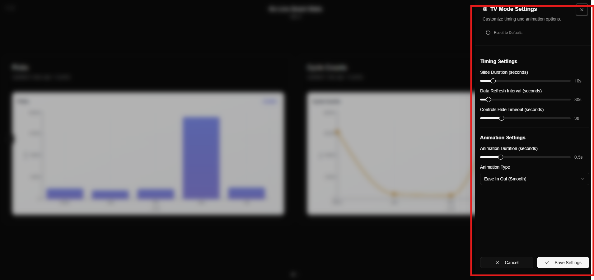

## Viewing Created Dashboards

After creating your dashboard, you can view all your dashboards on the **View Dashboard**.

- Navigate to **View Dashboards** from the Home Page.
- You can see your created dashboards here and select any dashboard from the **dropdown list**.

    

- Features available on this screen:
  - **Edit visuals positions** – rearrange your visuals as needed.
  - **Refresh data** – update your dashboard with the latest data directly.

    

  - **Change visual type** – click on the dropdown to switch between visual types such as **Line, Bar, Area, Pie**, etc.

    

### Sample Dashboard Example

- Our sample dashboard contains the **data files** we added earlier.
- There are **2 visuals** in this report:
  1. **Picks** – created by adding a file from the **Data Management** screen.
  2. **Order** – created using the **MOCA script**.

        

### TV View Mode
Enable **TV View** for automated, hands-free display of key dashboards — perfect for control rooms, warehouses, and offices.

### **TV Mode Customization:** 

You can customize all TV Mode settings from this panel.
- **Timing Controls:** Adjust slide duration, data refresh interval, and controls hide timeout.
- **Animation Controls:** Set animation duration and choose your preferred animation type.
- **Reset Option:** Quickly restore all TV Mode settings to their default values.

