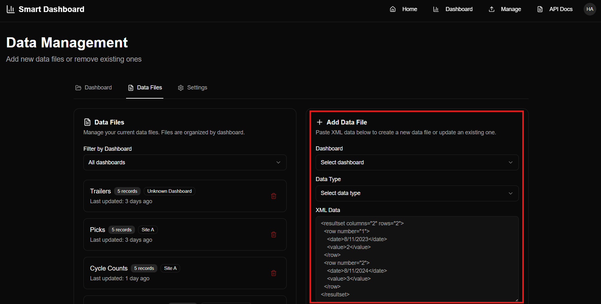

# Features

## Multi-Tenant and Multi-Environment Support
Organize data and dashboards per tenant or environment, allowing complete isolation and customization for each client or department.

## Easy Dataset Upload and Replacement
Easily upload CSV, Excel, or database-connected datasets. Replace existing datasets without disrupting linked dashboards.

## Real-Time, Interactive Visualization
Smart Dashboard delivers live, interactive data visualizations — supporting bar charts, line graphs, heatmaps, and more.

## TV View Mode
Enable **TV View** for automated, hands-free display of key dashboards — perfect for control rooms, warehouses, and offices.

## Secure and Scalable Architecture
Smart Dashboard follows enterprise security protocols, role-based access control, and data encryption — ensuring safe and efficient scalability.

## Custom Dashboard Templates *(optional)*
Create reusable dashboard templates for consistent reporting across teams.

