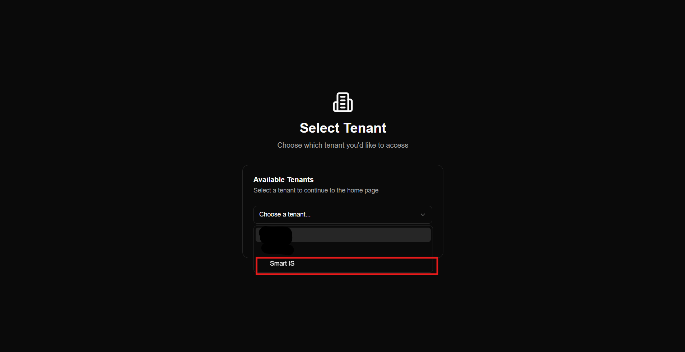
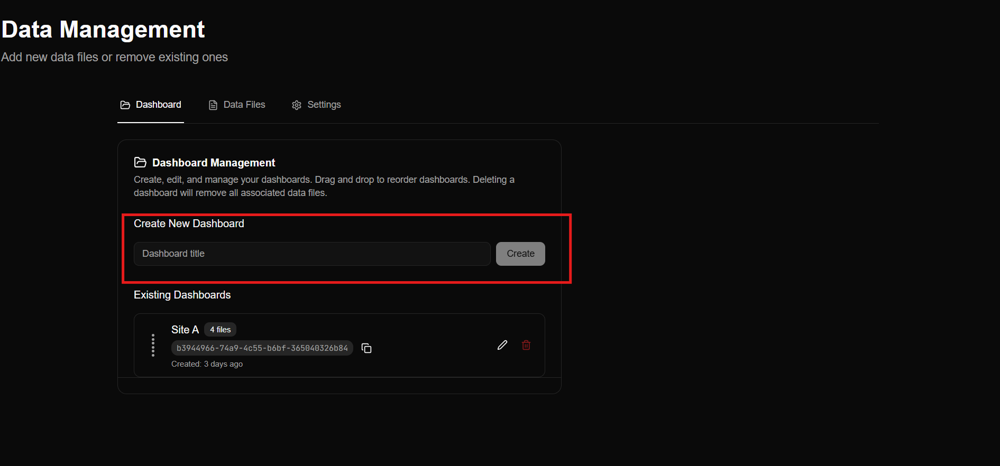
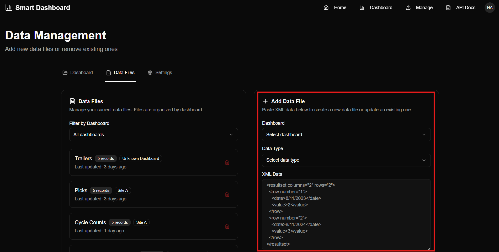
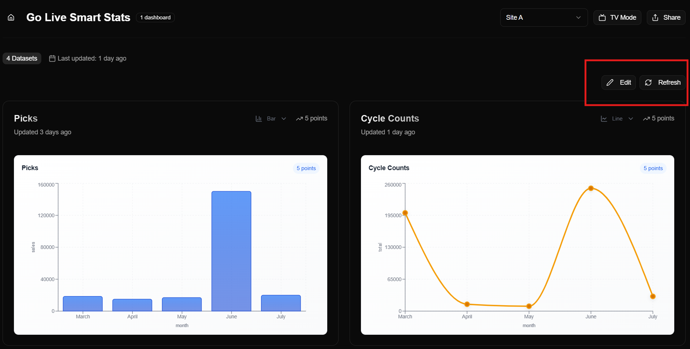

# Setup Guide

## Prerequisites
Before installing Smart Dashboard, ensure the following:
- Access to your Smart IS environment
- Admin credentials or user account with dashboard permissions
- Supported browsers: Chrome, Edge, or Firefox (latest versions)
- Internet connection

---

## Installation / Access
1. Log in to your **Smart IS Portal**.
2. Navigate to the **Smart Dashboard** module.
3. Select **Create New Dashboard Environment**.
4. Configure tenant details (if multi-tenant access is enabled).

5. Upload your initial dataset or connect to a data source.

---

## Configuration
- **User Roles:** Assign roles (Admin, Editor, Viewer) based on access levels.

- **Data Sources:** Connect via REST APIs, SQL databases, or CSV uploads.

- **Refresh Intervals:** Configure auto-refresh for real-time dashboards.

- **Notifications:** Enable alerting for threshold breaches or key KPI events.

---

## Deployment Notes
> *If hosted on-premise*, contact your Smart IS technical representative for environment-specific deployment documentation.
